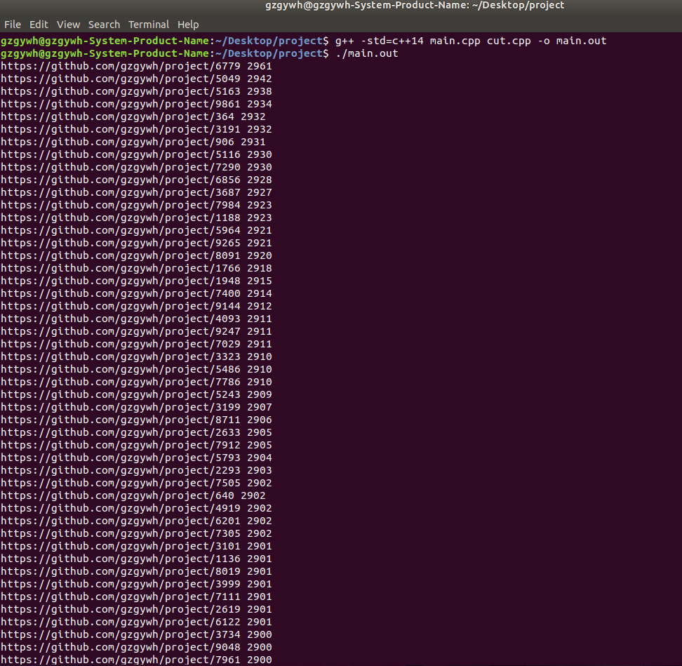

# project

#### 题目描述

100GB url 文件，使用 1GB 内存计算出出现次数 top100 的 url 和出现的次数。


#### 生成数据

用python脚本生成数据，在这里为了方便我们讲URL的前缀固定为我的github名称 https://github.com/gzgywh/project ，后面加上(0,9999)之间的随机数以区分不同的URL，运行命令如下：

```cc
python size filename
```

有2个可配置的参数。size为我要生成多大的数据，单位是GB(在程序内部做了换算)。filename为我要生成程序的名称，比如我要生成一个大小为1GB，名字为test的URL数据，命令如下：

```cc
python 1 testdata.txt
```


#### 设计思路


#### 运行方式

```cc
g++ -std=c++14 main.cpp cut.cpp -o main.out
./main.out
```


#### 实验结果




